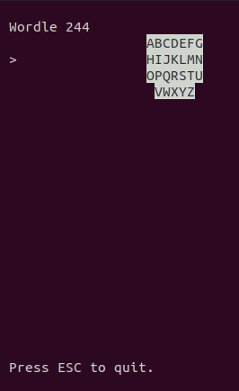

# **go-wordle**

**go-wordle** is a simple console application that allows user to play Wordle game in terminal. It is synchronized with official [*New York Times Wordle*](https://www.nytimes.com/games/wordle/index.html) game so you get the exact same word once per day in your terminal as on official game site.




**go-wordle** has two modes:

1. **ansi** mode - uses ansi terminal capabilities to have colors, Unicode characters, basic editing

2. **"poorman's"** mode - uses only 7-bit dumb terminal capabilities

## Installation
```
git clone github.com/firusvg/go-wordle
cd path/to/go-wordle
go get github.com/nsf/termbox-go
go get github.com/mattn/go-runewidth
go build 
./go-wordle
```

To force poorman's mode, start go-wordle with:

```
./go-wordle --poorman
```
